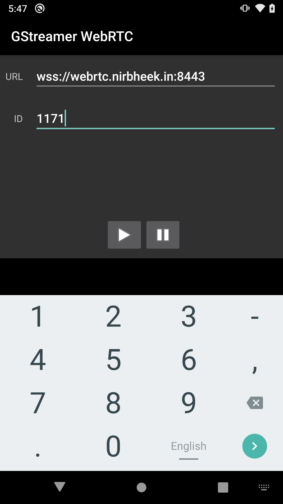

# GStreamer Android WebRTC demo翻车记

## 源码
源码位于`gst-examples`当中, 因此拉取`gst-examples`库:
```
$ git clone https://github.com/GStreamer/gst-examples.git
$ cd gst-examples
$ export ANDROID_HOME=~/Android/Sdk/
$ ./gradlew build
> Task :app:generateJsonModelDebug FAILED
/home/nickli/Android/Sdk/ndk-bundle/build/core/build-binary.mk:651: Android NDK: Module gstwebrtc depends on undefined modules: gstreamer_android    
... ...
/home/nickli/Android/Sdk/ndk-bundle/build/core/build-binary.mk:651: Android NDK: Module gstwebrtc depends on undefined modules: gstreamer_android    
/home/nickli/Android/Sdk/ndk-bundle/build/core/build-binary.mk:664: *** Android NDK: Note that old versions of ndk-build silently ignored this error case. If your project worked on those versions, the missing libraries were not needed and you can remove those dependencies from the module to fix your build. Alternatively, set APP_ALLOW_MISSING_DEPS=true to allow missing dependencies.    .  Stop.

FAILURE: Build failed with an exception.

* What went wrong:
Execution failed for task ':app:generateJsonModelDebug'.
> Build command failed.
  Error while executing process /home/nickli/Android/Sdk/ndk-bundle/
  
  ... ...

  /home/nickli/Android/Sdk/ndk-bundle/build/core/build-binary.mk:664: *** Android NDK: Note that old versions of ndk-build silently ignored this error case. If your project worked on those versions, the missing libraries were not needed and you can remove those dependencies from the module to fix your build. Alternatively, set APP_ALLOW_MISSING_DEPS=true to allow missing dependencies.    .  Stop.


* Try:
Run with --stacktrace option to get the stack trace. Run with --info or --debug option to get more log output. Run with --scan to get full insights.

* Get more help at https://help.gradle.org

Deprecated Gradle features were used in this build, making it incompatible with Gradle 6.0.
Use '--warning-mode all' to show the individual deprecation warnings.
See https://docs.gradle.org/5.6.4/userguide/command_line_interface.html#sec:command_line_warnings

BUILD FAILED in 1m 13s
4 actionable tasks: 4 executed
```

解决办法: 在`~/.gradle/gradle.properties`中添加配置:
```
gstAndroidRoot=/opt/work/gstreamer/gstreamer-1.0-android-universal-1.18.0/
```

其中`/opt/work/gstreamer/gstreamer-1.0-android-universal-1.18.0/`是下载好的:
```
$ mkdir -p /opt/work/gstreamer
$ cd /opt/work/gstreamer/
$ wget https://gstreamer.freedesktop.org/data/pkg/android/1.18.0/gstreamer-1.0-android-universal-1.18.0.tar.xz
$ cd gstreamer-1.0-android-universal-1.18.0
$ tar xvf ../gstreamer-1.0-android-universal-1.18.0.tar.xz
$ pwd
/opt/work/gstreamer/gstreamer-1.0-android-universal-1.18.0
$ ls arm64/share/gst-android/ndk-build/
androidmedia  fontconfig  gstreamer-1.0.mk  gstreamer_android-1.0.c.in  GStreamer.java  gstreamer_prebuilt.mk  plugins.mk  tools  tools.mk
```

然后再次编译:
```
$ ./gradlew build
```
参考链接: [从命令行构建您的应用](https://developer.android.com/studio/build/building-cmdline) 

编译安装完成后, 打开地址: [/webrtc.nirbheek.in](https://webrtc.nirbheek.in/), 可以看到:


可以看到服务器端等待id: `1171`

然后运行demo app, 输入id:  


点击连接按钮, 然后网页提示:`NotFoundError: Requested device not found`, 翻车...