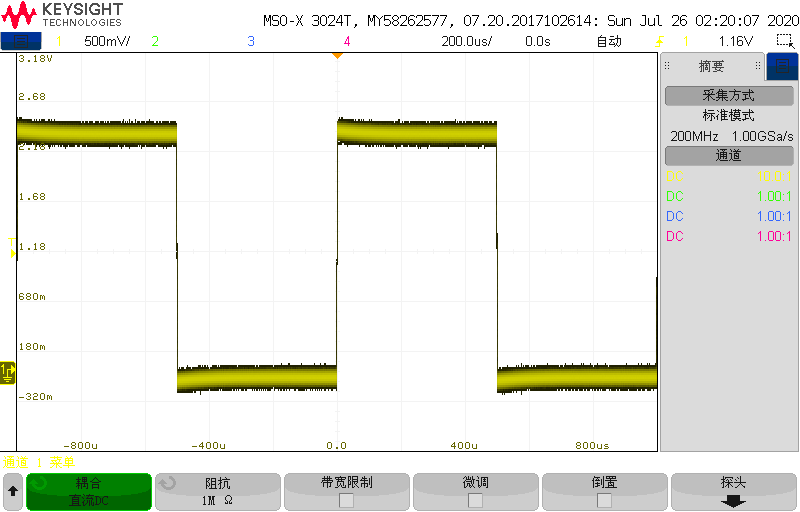

# PyVISA 控制 Keysight InfiniiVision 3000 系列示波器(@py)

## 文档
* [PyVISA - User guide](https://pyvisa.readthedocs.io/en/latest/introduction/index.html)
* [PyVISA - Installation](https://pyvisa.readthedocs.io/en/latest/introduction/getting.html#installation)
* *IDN (Identification Number)指令参考文档: [Keysight InfiniiVision
3000 X-Series Oscilloscopes - Programmer's
Guide](https://www.keysight.com/upload/cmc_upload/All/3000_series_prog_guide.pdf)

## 操作步骤:
首先安装必要的支持:
```
pip install -U pyvisa
pip install -U pyvisa-py
pip install -U PyUSB   (见下文)
```
**注:**如何安装**python**和**pip**不再此文讨论的范围内.

此时发现你得到的是空:
```
()
```
然后用sudo运行同样不行, 检查`dmesg`的输出:
```
[25055.047027] usb 7-2.4.4: new high-speed USB device number 7 using xhci_hcd
[25055.162368] usb 7-2.4.4: New USB device found, idVendor=2a8d, idProduct=1776, bcdDevice= 1.00
[25055.162370] usb 7-2.4.4: New USB device strings: Mfr=1, Product=2, SerialNumber=3
[25055.162372] usb 7-2.4.4: Product: MSO-X 3024T
[25055.162373] usb 7-2.4.4: Manufacturer: Keysight Technologies
[25055.162374] usb 7-2.4.4: SerialNumber: MY58262577
[25055.247466] usbcore: registered new interface driver usbtmc
```

修改`pyvisa.ResourceManager()`的地方, 为其加上参数:
```
#!/bin/python2.7

import pyvisa
# add '@ni'
rm = pyvisa.ResourceManager('@ni')
print(rm.list_resources())
```

再次执行收到了一个报错:
```
Traceback (most recent call last):
  File "test_visa.py", line 4, in <module>
    rm = pyvisa.ResourceManager('@ni')
  File "/home/liyang/.local/lib/python2.7/site-packages/pyvisa/highlevel.py", line 1553, in __new__
    visa_library = open_visa_library(visa_library)
  File "/home/liyang/.local/lib/python2.7/site-packages/pyvisa/highlevel.py", line 1525, in open_visa_library
    return cls(argument)
  File "/home/liyang/.local/lib/python2.7/site-packages/pyvisa/highlevel.py", line 98, in __new__
    raise OSError('Could not open VISA library:\n' + '\n'.join(errs))
OSError: Could not open VISA library:
```

这时你需要安装visa的支持库
```
sudo apt install libvisa-dev
```

如何**非root**访问设备?
添加规则到**/etc/udev/rules.d/40-keysight.rules**:
```
SUBSYSTEM=="usb", ATTR{idProduct}=="1776", ATTR{idVendor}=="2a8d", MODE="0660", GROUP="<你的用户组>"
```
然后执行:
```
sudo udevadm control --reload
```

然后运行上述脚本, 输出:
```
(u'USB7::0x2a8d::0x1776::MY58262577',)
```

然后试图操作设备, 编写脚本
```
import pyvisa

rm = pyvisa.ResourceManager('@ni')
print(rm.list_resources())
keysight = rm.open_resource("USB7::0x2a8d::0x1776::MY58262577")
print(keysight.query('*IDN?'))
```
很不幸, 的到了输出:
```
Traceback (most recent call last):
  File "test_visa.py", line 5, in <module>
    keysight = rm.open_resource("USB7::0x2a8d::0x1776::MY58262577")
  File "/home/liyang/.local/lib/python2.7/site-packages/pyvisa/highlevel.py", line 1771, in open_resource
    res.open(access_mode, open_timeout)
  File "/home/liyang/.local/lib/python2.7/site-packages/pyvisa/resources/resource.py", line 218, in open
    self.session, status = self._resource_manager.open_bare_resource(self._resource_name, access_mode, open_timeout)
  File "/home/liyang/.local/lib/python2.7/site-packages/pyvisa/highlevel.py", line 1725, in open_bare_resource
    return self.visalib.open(self.session, resource_name, access_mode, open_timeout)
  File "/home/liyang/.local/lib/python2.7/site-packages/pyvisa-py/highlevel.py", line 194, in open
    sess = cls(session, resource_name, parsed, open_timeout)
  File "/home/liyang/.local/lib/python2.7/site-packages/pyvisa-py/sessions.py", line 170, in __init__
    raise ValueError(msg)
ValueError: Please install PyUSB to use this resource type.
No module named usb
```

参考:[PyVISA - AttributeError: 'NIVisaLibrary' object has no attribute 'viParseRsrcEx'
](https://stackoverflow.com/questions/51520737/pyvisa-attributeerror-nivisalibrary-object-has-no-attribute-viparsersrcex)

试图修改后端:
```
import pyvisa

rm = pyvisa.ResourceManager('@py')
print(rm.list_resources())
keysight = rm.open_resource("USB7::0x2a8d::0x1776::MY58262577")
print(keysight.query('*IDN?'))
```

得到输出:
```
Traceback (most recent call last):
  File "test_visa.py", line 5, in <module>
    keysight = rm.open_resource("USB7::0x2a8d::0x1776::MY58262577")
  File "/home/liyang/.local/lib/python2.7/site-packages/pyvisa/highlevel.py", line 1771, in open_resource
    res.open(access_mode, open_timeout)
  File "/home/liyang/.local/lib/python2.7/site-packages/pyvisa/resources/resource.py", line 218, in open
    self.session, status = self._resource_manager.open_bare_resource(self._resource_name, access_mode, open_timeout)
  File "/home/liyang/.local/lib/python2.7/site-packages/pyvisa/highlevel.py", line 1725, in open_bare_resource
    return self.visalib.open(self.session, resource_name, access_mode, open_timeout)
  File "/home/liyang/.local/lib/python2.7/site-packages/pyvisa-py/highlevel.py", line 194, in open
    sess = cls(session, resource_name, parsed, open_timeout)
  File "/home/liyang/.local/lib/python2.7/site-packages/pyvisa-py/sessions.py", line 170, in __init__
    raise ValueError(msg)
ValueError: Please install PyUSB to use this resource type.
No module named usb
```
只能安装PyUSB:
```
pip install PyUSB
```

最后修正脚本为:
```
import pyvisa

rm = pyvisa.ResourceManager('@py')
print(rm.list_resources())
# 使用@ni后端得到的是"USB7::0x2a8d::0x1776::MY58262577", 其实@py后端也可以用
# 但是建议用@py后端的rm.list_resources()实际输出的结果为准
# keysight = rm.open_resource("USB7::0x2a8d::0x1776::MY58262577")
keysight = rm.open_resource("USB0::10893::6006::MY58262577::0::INSTR")
print(keysight.query('*IDN?'))
```

此时示波器返回命令的响应:
```
(u'USB0::10893::6006::MY58262577::0::INSTR',)
KEYSIGHT TECHNOLOGIES,MSO-X 3024T,MY58262577,07.20.2017102614
```

对于示波器所有适用的**SCPI**指令可以参考Keysight提供的参考资料, 另外: Keysight还提供了一个关于SCPI的学习页面: [SCPI Learning Page](https://www.keysight.com/main/editorial.jspx?cc=CN&lc=chi&ckey=1688330&id=1688330) 

再附一个电脑通过USB截图示波器显示的例子:
```
import pyvisa

rm = pyvisa.ResourceManager('@py')
print(rm.list_resources())
# keysight = rm.open_resource("USB7::0x2a8d::0x1776::MY58262577")
keysight = rm.open_resource("USB0::10893::6006::MY58262577::0::INSTR")
print(keysight.query('*IDN?'))
keysight.write(":DISPlay:DATA? PNG, COLor")
keysight
bmpdata = keysight.read_raw()[1+9:]
keysight.close()
with open( "out.png", "wb") as f:
    f.write( bmpdata )
```

输出的截图会保存在执行脚本的当前目录下, 名字为**out.png**的文件中, 特别注意在仪表返回的数据中, 认为的跳过了**10**个字节, 截取到的图片如下:
